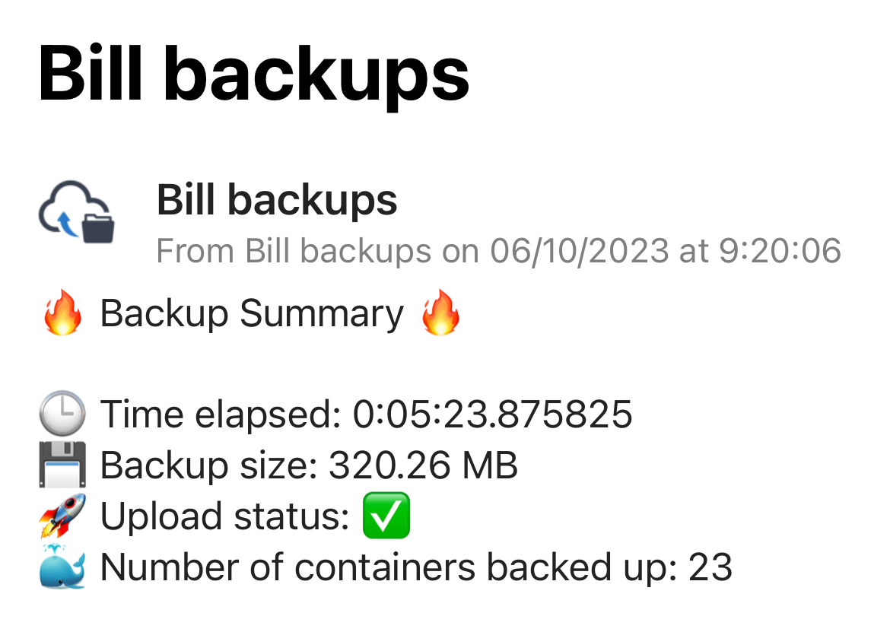

<!DOCTYPE html>
<html lang="en">
<head>
<meta charset="UTF-8">
<meta name="viewport" content="width=device-width, initial-scale=1.0">
</head>
<body>

<h1>Docker Backup Script</h1>

This script is tailored for Linux-based systems to automate the backup process of Docker containers along with their respective volumes. Unfortunately, it is not compatible with Windows. The script operates by halting the running containers, backing up their configurations and volumes, and subsequently restarting the containers in a designated order or all at once if no order is delineated.

    
     
    <i>Above is a screenshot illustrating how the notifications appear on Pushover.</i>

<h2>Prerequisites</h2>

Ensure the following prerequisites are satisfied before executing the script:

<ul>
    <li><strong>Python 3:</strong> The script is written in Python 3. Ensure it's installed on your system.</li>
    <li><strong>Docker:</strong> Docker needs to be installed and operational on your system.</li>
    <li><strong>pigz:</strong> The script utilizes <a href="https://zlib.net/pigz/" target="_blank">pigz</a> for parallel gzip compression. Install it via your system's package manager, e.g., on Ubuntu: <code>sudo apt-get install pigz</code>.</li>
    <li><strong>rclone (Optional):</strong> If off-site backups are desired, configure <a href="https://rclone.org/" target="_blank">rclone</a> with your cloud storage provider.</li>
    <li><strong>Pushover (Optional):</strong> To receive notifications on backup status, set up a <a href="https://pushover.net/" target="_blank">Pushover</a> account and install the app on your device.</li>
</ul>

<h2>Configuration</h2>

The script contains a configuration section at its beginning, allowing you to tailor various settings to match your environment:

<pre><code>
# Configuration section

# Temporary directory for creating backup files before moving them to the final backup directory
# Specify a directory path where temporary backup files will be stored.
TEMP_BACKUP_DIR = "/tmp/"

# Base directory where backups are stored
# Specify the directory path where the final backup files will be stored.
BASE_BACKUP_DIR = "/backups/"

# Maximum number of backups to keep (older backups will be deleted)
# Specify the maximum number of backup directories to keep. Older backups will be deleted.
MAX_BACKUPS = 8

# Directory containing Docker volumes / data
# Specify the directory path where your Docker volumes are located.
DOCKER_VOLUME_DIR = "/path/to/your/docker_volumes"

# Additional directories to backup (Optional)
# If you have any additional directories you want to backup alongside your Docker volumes, specify them here.
# The backups will be named after the directory's base name and stored in the same location as other backups.
ADDITIONAL_DIRECTORIES_TO_BACKUP = [
    "/path/to/first/directory",
    "/path/to/second/directory",
    # Add as many directories as you wish.
]

# Off-site backup destination using rclone
# Specify the rclone remote name and path where backups should be copied.
# Leave it blank if you do not wish to use rclone for off-site backups.
RCLONE_DESTINATION = "your_cloud_drive:Backups/"

# Pushover credentials for receiving notifications
# Specify your Pushover API token and user key to receive notifications.
# Leave them blank if you do not wish to receive notifications.
PUSHOVER_API_TOKEN = "YourTokenHere"
PUSHOVER_USER_KEY = "YourUserKeyHere"

# List of Docker containers to be restarted in the specified order after backup
# Specify the names of your Docker containers in the order you want them to be restarted.
# Use the command: docker ps --format '{{.Names}}' to get the list of running containers.
CONTAINERS_IN_ORDER = ["mosquitto", "zigbee2mqtt", "esphome", "homeassistant"]

</code></pre>

<h2>Script Operation Breakdown</h2>

Here’s a step-by-step breakdown of what the script does:

<ol>
    <li><strong>Preparation:</strong> A unique backup directory is created based on the current date and time.</li>
    <li><strong>Stopping Containers:</strong> All running Docker containers are halted.</li>
    <li><strong>Configuration Backup:</strong> Each container's configuration is backed up as a JSON file.</li>
    <li><strong>Data Backup:</strong> Docker volumes are compressed into a tar.gz file using pigz for faster compression.</li>
    <li><strong>Additional Directory Backup:</strong> Any additional directories specified in the configuration are backed up.</li>
    <li><strong>Restarting Containers:</strong> Containers are restarted in the order specified or all at once if no order is provided.</li>
    <li><strong>Off-site Backup (Optional):</strong> If configured, the backup directory is copied to a remote location using rclone.</li>
    <li><strong>Local Backup Cleanup:</strong> Older local backups are deleted, ensuring only a specified number of backups are retained.</li>
    <li><strong>Notification (Optional):</strong> A notification summarizing the backup details is sent via Pushover.</li>
</ol>

<h2>Running the Script</h2>

The script should be executed with superuser privileges to avoid permission issues, although users can adapt the script to suit their requirements. Use the following command to run the script:

<pre><code>
sudo python3 docker_backup.py
</code></pre>

<h2>Automating the Script with Crontab</h2>

To automate the backup process, you can schedule the script to run at specific intervals using crontab. Follow the steps below:

<ol>
    <li>Open the root user's crontab file by running the following command in the terminal:</li>
    <pre><code>sudo crontab -e</code></pre>
    <li>This will open the crontab file in the default text editor. Add a new line to the file with the following format to schedule your script:</li>
    <pre><code>MIN HOUR DOM MON DOW /usr/bin/python3 /path/to/your/backup_script.py</code></pre>
    <ul>
        <li><strong>MIN:</strong> Minute field (0 to 59)</li>
        <li><strong>HOUR:</strong> Hour field (0 to 23)</li>
        <li><strong>DOM:</strong> Day of Month field (1 to 31)</li>
        <li><strong>MON:</strong> Month field (1 to 12)</li>
        <li><strong>DOW:</strong> Day of Week field (0 to 6) (0 for Sunday)</li>
        <li>Adjust the fields according to your preferred schedule.</li>
    </ul>
    <li>For example, to run the script every day at 3:00 AM, you would add the following line to the crontab file:</li>
    <pre><code>0 3 * * * /usr/bin/python3 /path/to/your/backup_script.py</code></pre>
    <li>Save and close the crontab file. The new cron job is now scheduled, and will run the backup script at the specified time.</li>
</ol>

Note: Ensure that the script is executable and the path to the script in the crontab file is correct.

<h2>Contact</h2>

For any additional inquiries or issues, feel free to open an issue on this repository.

</body>
</html>
